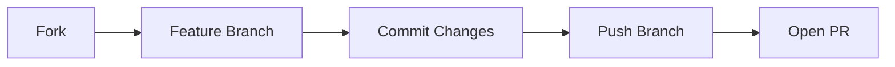

# 🎮 Setback Card Game

<div align="center">

[](https://nextjs.org/)
[](https://www.typescriptlang.org/)
[](https://tailwindcss.com/)
[](LICENSE)


**A modern web implementation of the classic Setback card game, featuring real-time gameplay, interactive tutorials, and a polished user interface.**

[Demo](https://setback.vercel.app) · [Report Bug](../../issues) · [Request Feature](../../issues)

</div>

---

## ✨ Features

<details open>
<summary><b>🎲 Game Mechanics</b></summary>

- Complete implementation of Setback rules and scoring
- Partnership system with teams of two players
- Bidding system with pass/bid options
- Trump suit selection mechanics
- Trick-taking gameplay with proper card hierarchy
- Joker card implementation as highest trump
</details>

<details open>
<summary><b>🎨 User Interface</b></summary>

- Responsive design that works on desktop and mobile devices
- Smooth card animations for dealing, playing, and collecting
- Interactive drag-and-drop card play system
- Real-time game state updates
- Professional styling with modern aesthetics
- Clear visual indicators for current player, trump suit, and game phase
</details>

<details open>
<summary><b>⚙️ Game Management</b></summary>

- Save and load game functionality
- Undo/Redo system with keyboard shortcuts (⌘Z/⌘⇧Z or Ctrl+Z/Ctrl+Y)
- Player name customization
- Game state persistence
- Partnership score tracking
- Round history tracking
</details>

<details open>
<summary><b>📚 Learning & Assistance</b></summary>

- Interactive tutorial system for new players
- Contextual help and tooltips
- Visual guides for valid moves
- Clear feedback for illegal actions
- Game rules reference
</details>

## 🛠️ Technical Architecture

<details>
<summary><b>🔧 Frontend Technologies</b></summary>

| Technology | Description |
|------------|-------------|
| **Next.js 15** | React framework for production-grade applications |
| **TypeScript** | Static typing for enhanced code reliability |
| **Tailwind CSS** | Utility-first CSS framework for modern styling |
| **React Context API** | State management solution |
| **React DnD** | Drag and drop functionality for card interactions |
</details>

<details>
<summary><b>📊 State Management</b></summary>

- Custom game state reducer for predictable state updates
- Context-based state distribution
- Action-based state modifications
- History tracking for undo/redo functionality
</details>

<details>
<summary><b>🧩 Game Logic</b></summary>

- Modular game rule implementation
- Separate concerns for:
  ```
  ├── Card management
  ├── Bidding system
  ├── Trick resolution
  ├── Score calculation
  └── Partnership handling
  ```
</details>

<details>
<summary><b>⚡ Performance Optimizations</b></summary>

- Efficient re-rendering with React.memo
- Optimized animations
- Lazy loading of game components
- Memoized computation of game state
</details>

## 🚀 Getting Started

### Prerequisites

- Node.js 18.0 or higher
- npm or yarn package manager

### Installation

1. Clone the repository
   ```sh
   git clone https://github.com/[your-username]/setback-njs.git
   ```

2. Install dependencies
   ```sh
   cd setback-njs
   npm install
   ```

3. Run the development server
   ```sh
   npm run dev
   ```

4. Open [http://localhost:3000](http://localhost:3000) in your browser

## 📖 Game Rules

<details open>
<summary><b>🎯 Overview</b></summary>

Setback is a trick-taking card game played with a standard 52-card deck plus one Joker. The game is played between two partnerships of two players each.
</details>

<details>
<summary><b>🏆 Scoring System</b></summary>

| Point Type | Value | Description |
|------------|-------|-------------|
| High Trump | 1 point | Highest trump card played |
| Low Trump | 1 point | Lowest trump card played |
| Jack of Trump | 1 point | Jack of the trump suit |
| Off Jack | 1 point | Jack of the same color as trump |
| Joker | 1 point | Always highest trump |
| Game Points | 1 point | Most total points from tricks |
</details>

<details>
<summary><b>💫 Bidding</b></summary>

- Minimum bid of 2
- Players can pass or increase the bid
- Highest bidder names trump suit
- Bidding partnership must make their bid to score
</details>

<details>
<summary><b>🔄 Gameplay Flow</b></summary>

1. Deal 6 cards to each player
2. Bidding round
3. Trump selection
4. Play of tricks
5. Score calculation
6. Next deal
</details>

## 🤝 Contributing

We welcome contributions to improve the Setback Card Game! Here's how you can help:



1. Fork the repository
2. Create your feature branch (`git checkout -b feature/AmazingFeature`)
3. Commit your changes (`git commit -m 'Add some AmazingFeature'`)
4. Push to the branch (`git push origin feature/AmazingFeature`)
5. Open a Pull Request

## 📄 License

This project is licensed under the MIT License - see the [LICENSE](LICENSE) file for details.
